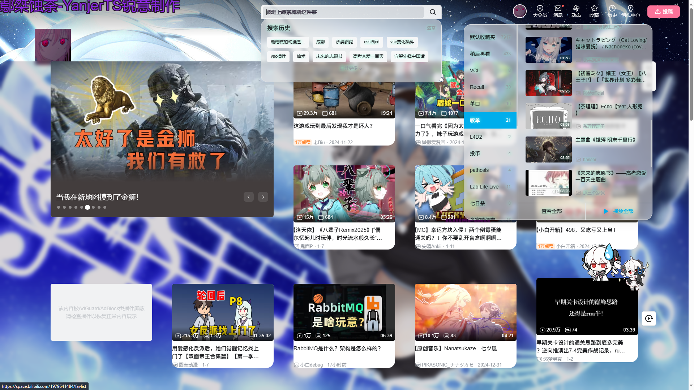

## 基于`Stylus`实现的b站主页css更改

#### 进度
 + 替换logo
 + 隐藏header多余按钮
 + 隐藏视屏上分区box
 + 隐藏最右侧推荐其他分区视频
 + 隐藏视屏中左上角轮播推荐[bug]
 + 搜索框居中  热搜隐藏
 + 背景图隐藏 增加全屏fixed背景  用随机背景api[优化](请求的图片为原图  请求压缩的背景图api 加快背景显示 优化用户体验)
 + 窗口主题更改毛玻璃效果(个人简介和大会员未生效)

### 可选功能
 源码中包含两个 `/*   用户可选功能 == ==== */ .......  /* =============* /`
 其中内容默认注释掉  可以自行解除注释
 分别为
 + 隐藏视频box 不用的时候可以看壁纸 在鼠标移入时显示(没做动画  而且有点小卡)
 + 视频box添加背景毛玻璃(但是背景图会被模糊且无法看到)
不开就是默认正常背景可以看到

### 联系
+ [YouTuBe](https://www.youtube.com/@YanjerTS)
+ [BiliBili](https://space.bilibili.com/1979641484')
  
